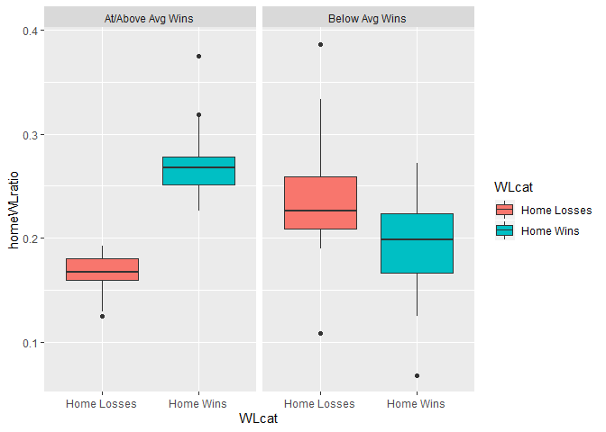
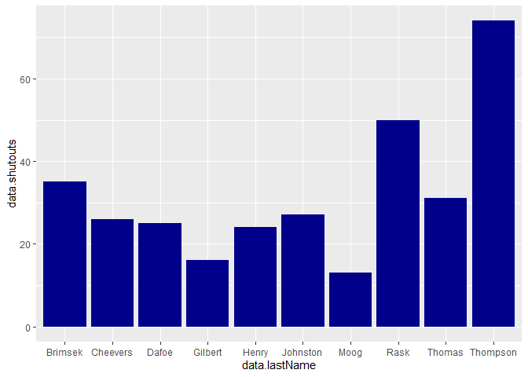
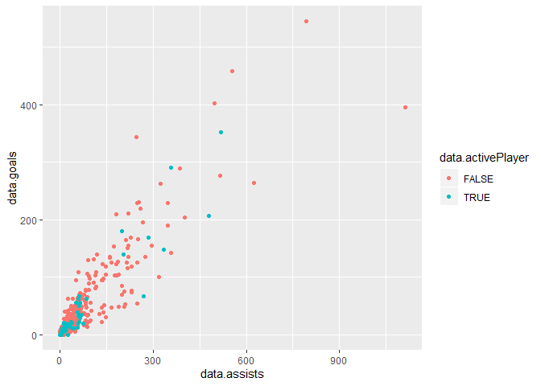
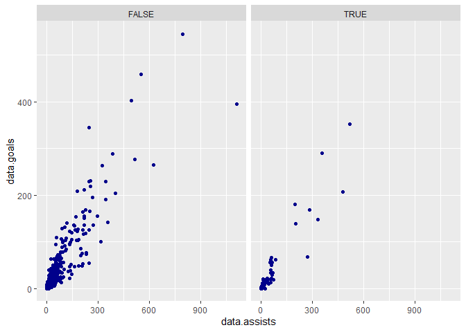

ST 558 Project 1
================
Jessica Speer
June 11, 2020

-   [JSON overview](#json-overview)
-   [Reading JSON Data into R](#reading-json-data-into-r)
-   [Function to Return Parsed Data from NHL API](#function-to-return-parsed-data-from-nhl-api)
    -   [Using the Function](#using-the-function)
-   [Explore the NHL Data](#explore-the-nhl-data)
    -   [Categorical and Numerical Summaries](#categorical-and-numerical-summaries)
    -   [Boxplots](#boxplots)

JSON overview
=============

Reading JSON Data into R
========================

Function to Return Parsed Data from NHL API
===========================================

The function that is generated below enables the user to pull several data sets from the NHL API.

**Usage:**

`getNHL(dataset, franchiseID)`

**Arguments:**

`dataset`: Enter `"franchise"`, `"teamtotals"`, `"seasonrecs"`, `"goalierecs"`, or `"skaterrecs"`

`franchiseID`: Valid Franchise ID required for `"seasonrecs"`, `"goalierecs"`, and `"skaterrecs"`

**Datasets:**

`"franchise"`: Returns id, firstSeasonId and lastSeasonId and name of every team in the history of the NHL

`"teamtotals"`: Returns total stats for every franchise (ex roadTies, roadWins, etc)

`"seasonrecs"`: Drill-down into season records for a specific franchise

`"goalierecs"`: Goalie records for the specified franchise

`"skaterrecs"`: (Skater records, same interaction as goalie endpoint

**Function generation:**

``` r
getNHL <- function(str1=NULL, id=NULL) {
  if (is.null(str1)){
    return("Please enter desired data and Franchise ID (if applicable)")
  } 
  else
  s1<-stri_compare(str1, "franchise")
  if (s1==0){
    f<-GET("https://records.nhl.com/site/api/franchise")
    f<-content(f, "text")
    f<-fromJSON(f,flatten=TRUE)
    f<-data.frame(f)
    f<-tbl_df(f)
    f <- f %>% select(data.id, data.firstSeasonId, data.lastSeasonId, data.teamCommonName)
    return(f)
  }
  else
  s2<-stri_compare(str1, "teamtotals")
  if (s2==0){
    f<-GET("https://records.nhl.com/site/api/franchise-team-totals")
    f<-content(f, "text")
    f<-fromJSON(f,flatten=TRUE)
    f<-data.frame(f)
    f<-tbl_df(f)
    return(f)
  }
  else
  s3<-stri_compare(str1, "seasonrecs")
  s4<-stri_compare(str1, "goalierecs")
  s5<-stri_compare(str1, "skaterrecs")
  if ((s3==0 | s4==0 | s5==0) & is.null(id)){
    return("Please enter a Franchise ID in the second argument.")
  }
  else
  `%notin%` <- Negate(`%in%`)
  if ((s3==0 | s4==0 | s5==0) & id %notin% 1:38){
    return("Franchise ID not recognized.")
  }  
  else
  if (s3==0 & id %in% 1:38){
    f<-GET(paste0("https://records.nhl.com/site/api/franchise-season-records?cayenneExp=franchiseId=", id))
    f<-content(f, "text")
    f<-fromJSON(f,flatten=TRUE)
    f<-data.frame(f)
    f<-tbl_df(f)
    return(f)
  }
  else
  if (s4==0 & id %in% 1:38){
    f<-GET(paste0("https://records.nhl.com/site/api/franchise-goalie-records?cayenneExp=franchiseId=", id))
    f<-content(f, "text")
    f<-fromJSON(f,flatten=TRUE)
    f<-data.frame(f)
    f<-tbl_df(f)
    return(f)
  }
  else
  if (s5==0 & id %in% 1:38){
    f<-GET(paste0("https://records.nhl.com/site/api/franchise-skater-records?cayenneExp=franchiseId=", id))
    f<-content(f, "text")
    f<-fromJSON(f,flatten=TRUE)
    f<-data.frame(f)
    f<-tbl_df(f)
    return(f)
  }  
}
```

Using the Function
------------------

The function can be used to call several NHL data sets from the API. Examples are illustrated below.

**Call Franchise data, select variables**

``` r
getNHL("franchise") %>% select(data.firstSeasonId, data.teamCommonName) %>% head(n=10)
```

    ## # A tibble: 10 x 2
    ##    data.firstSeasonId data.teamCommonName
    ##                 <int> <chr>              
    ##  1           19171918 Canadiens          
    ##  2           19171918 Wanderers          
    ##  3           19171918 Eagles             
    ##  4           19191920 Tigers             
    ##  5           19171918 Maple Leafs        
    ##  6           19241925 Bruins             
    ##  7           19241925 Maroons            
    ##  8           19251926 Americans          
    ##  9           19251926 Quakers            
    ## 10           19261927 Rangers

**Call Team Totals data, select variables**

``` r
getNHL("teamtotals") %>% select(data.teamName, data.homeWins) %>% head(n=10)
```

    ## # A tibble: 10 x 2
    ##    data.teamName       data.homeWins
    ##    <chr>                       <int>
    ##  1 New Jersey Devils             783
    ##  2 New Jersey Devils              74
    ##  3 New York Islanders            942
    ##  4 New York Islanders             84
    ##  5 New York Rangers             1600
    ##  6 New York Rangers              137
    ##  7 Philadelphia Flyers           131
    ##  8 Philadelphia Flyers          1204
    ##  9 Pittsburgh Penguins          1116
    ## 10 Pittsburgh Penguins           111

**Call Season Records data, select variables**

``` r
getNHL("seasonrecs", 38) %>% select(data.franchiseName, data.homeWinStreak)
```

    ## # A tibble: 1 x 2
    ##   data.franchiseName   data.homeWinStreak
    ##   <chr>                             <int>
    ## 1 Vegas Golden Knights                  8

**Call Goalie Records data, select variables**

``` r
getNHL("goalierecs", 38) %>% select(data.firstName, data.lastName, data.wins)
```

    ## # A tibble: 7 x 3
    ##   data.firstName data.lastName data.wins
    ##   <chr>          <chr>             <int>
    ## 1 Marc-Andre     Fleury               91
    ## 2 Maxime         Lagace                6
    ## 3 Oscar          Dansk                 3
    ## 4 Malcolm        Subban               30
    ## 5 Dylan          Ferguson              0
    ## 6 Garret         Sparks                0
    ## 7 Robin          Lehner                3

**Call Skater Records data, select variables**

``` r
getNHL("skaterrecs", 38) %>% select(data.firstName, data.lastName, data.points) %>% head(n=10)
```

    ## # A tibble: 10 x 3
    ##    data.firstName data.lastName data.points
    ##    <chr>          <chr>               <int>
    ##  1 Deryk          Engelland              41
    ##  2 James          Neal                   44
    ##  3 Ryan           Reaves                 37
    ##  4 David          Perron                 66
    ##  5 Jason          Garrison                1
    ##  6 Luca           Sbisa                  14
    ##  7 Brayden        McNabb                 40
    ##  8 Reilly         Smith                 167
    ##  9 Tomas          Tatar                   6
    ## 10 Brandon        Pirri                  23

Explore the NHL Data
====================

Categorical and Numerical Summaries
-----------------------------------

We will start with the Team Totals dataset, which includes total stats for each franchise. We will limit to game type "2" for simplicity.

``` r
t<-getNHL("teamtotals")
t<-t[t$data.gameTypeId==2,]
```

We will first explore the win ratios (wins/games played). We will need to generate and assign some variables. We will create a categorical variable to indicate whether a franchise had a below average win ratio or at/above average.

``` r
t$WinRatio<-t$data.wins/t$data.gamesPlayed
avgWins<-mean(t$WinRatio)
t$WinCat<-NA
t$WinCat[t$WinRatio < avgWins] <- "Below Avg Wins"
t$WinCat[t$WinRatio >= avgWins] <- "At/Above Avg Wins"
```

Let's take a look at the win ratio distributions overall and by win ratio category.

**Overall**

``` r
summary(t$WinRatio)
```

    ##    Min. 1st Qu.  Median    Mean 3rd Qu.    Max. 
    ## 0.09091 0.36957 0.43911 0.40273 0.46816 0.56596

**Below Average Win Ratio**

``` r
summary(t$WinRatio[t$WinRatio < avgWins])
```

    ##    Min. 1st Qu.  Median    Mean 3rd Qu.    Max. 
    ## 0.09091 0.23542 0.32473 0.29819 0.37302 0.39583

**At/Above average Win Ratio**

``` r
summary(t$WinRatio[t$WinRatio >= avgWins])
```

    ##    Min. 1st Qu.  Median    Mean 3rd Qu.    Max. 
    ##  0.4150  0.4422  0.4604  0.4637  0.4768  0.5660

We can create a second categorical variable using a ratio of penalty minutes (penalty min/games played). This will allow us to demonstrate a contingency table.

``` r
t$PMinRatio<-t$data.penaltyMinutes/t$data.gamesPlayed
avgPMins<-mean(t$PMinRatio)
t$PMinCat<-NA
t$PMinCat[t$PMinRatio < avgPMins] <- "Below Avg Penalty Mins"
t$PMinCat[t$PMinRatio >= avgPMins] <- "At/Above Avg Penalty Mins"
t1<-table(t$WinCat, t$PMinCat)
knitr::kable(t1, row.names=TRUE, caption = "Avg Wins vs Avg Penality Min")
```

|                   |  At/Above Avg Penalty Mins|  Below Avg Penalty Mins|
|-------------------|--------------------------:|-----------------------:|
| At/Above Avg Wins |                         24|                      12|
| Below Avg Wins    |                          5|                      16|

It appears that the at/above avg win ratio group shares a higher proportion with the above avg penalty minute ratio group, and the opposite is observed for the below avg win ratio group.

Boxplots
--------

Now let's move on to some graphics! We will start with boxplots. First, we will stack the data so that we can look at home wins and home losses side by side.

``` r
t$WinCat<-as.factor(t$WinCat)
homewins<-t %>% select(data.franchiseId, WinCat, homeWL=data.homeWins, data.gamesPlayed)
homewins<-data.frame(homewins)
homewins$WLcat<-"Home Wins"
homeloss<-t %>% select(data.franchiseId, WinCat, homeWL=data.homeLosses, data.gamesPlayed)
homeloss<-data.frame(homeloss)
homeloss$WLcat<-"Home Losses"
homedata<-rbind(homewins, homeloss)
homeWLratio<-homedata$homeWL/homedata$data.gamesPlayed
```

Generate boxplots of the home win/loss ratios, with the avg win level indicator variable as the facet wrap.

``` r
g <- ggplot(homedata, aes(x=WLcat, y=homeWLratio, fill=WLcat)) + geom_boxplot() + facet_wrap(homedata$WinCat)
g
```



It appears that the at/above avg win ratio group may have had more of a home field advantage than the below avg win ratio group, who's boxplot distributions are closer together between home wins and home losses.

``` r
rm(t)
f<-getNHL("goalierecs", 6)
f<-f[f$data.gamesPlayed>=200,]
g <- ggplot(f, aes(x=data.lastName, y=data.shutouts)) + geom_col(fill="darkblue")
g
```



``` r
s<-getNHL("skaterrecs", 6)
data.activePlayer<-as.factor(s$data.activePlayer)
g <- ggplot(s, aes(x=data.assists, y=data.goals, color=data.activePlayer)) + geom_point()
g
```



``` r
g <- ggplot(s, aes(x=data.assists, y=data.goals)) + geom_point(color="darkblue") + facet_wrap(s$data.activePlayer)
g
```


